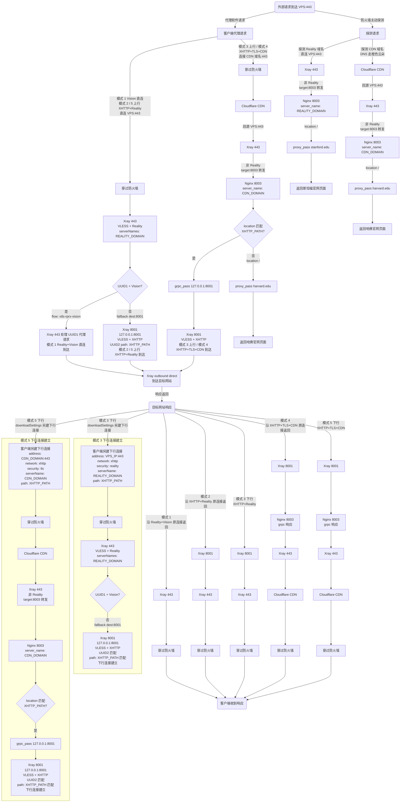
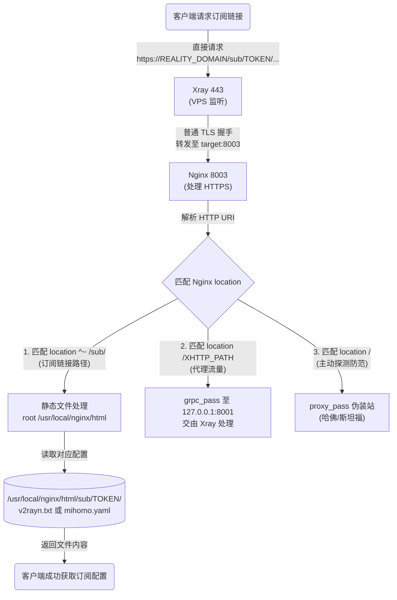

# 流程图

## 去程 + 回程流程图

## 订阅链接获取流程

脚本会在 `/usr/local/nginx/html/sub/` 目录下生成随机 Token 文件夹，存放客户端配置文件。默认订阅地址为：

- `https://REALITY_DOMAIN/sub/TOKEN/v2rayn.txt`
- `https://REALITY_DOMAIN/sub/TOKEN/mihomo.yaml`

