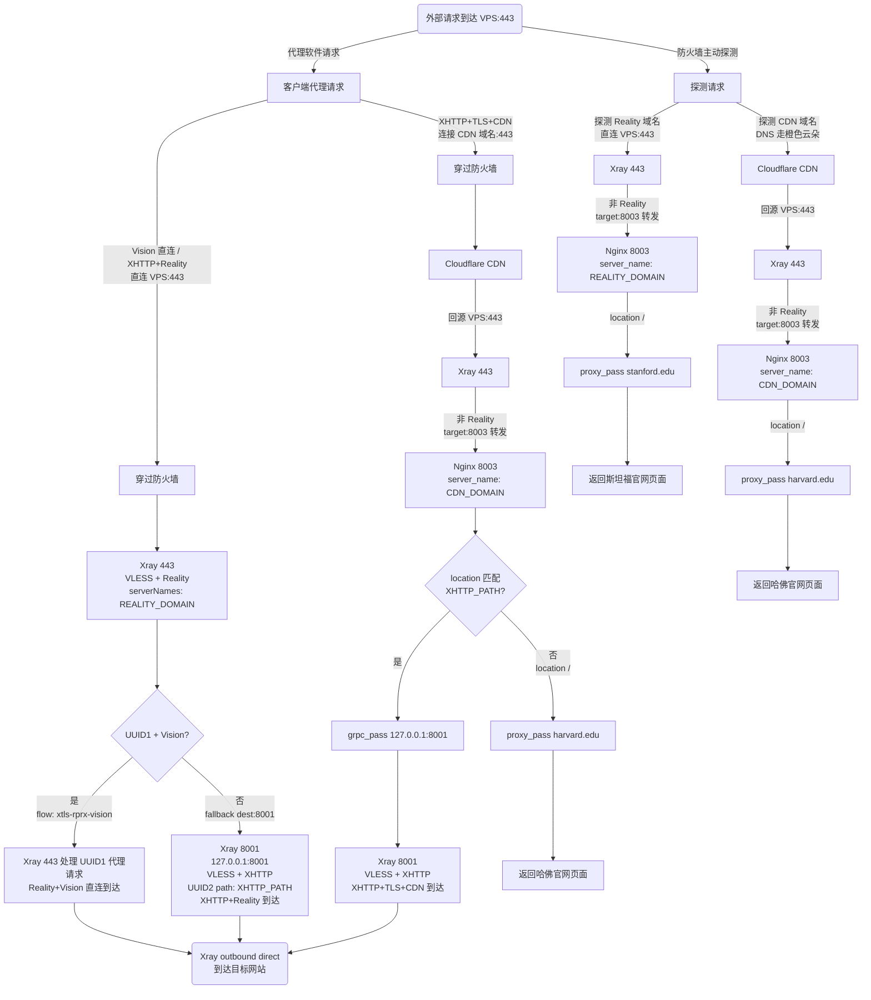

# XHTTP + CDN 配置指南

这个仓库用于整理一套基于 Xray-core 的 XHTTP + CDN 搭建方案，覆盖环境准备、服务端配置和客户端模板三部分内容。

## 仓库文档

- [1.环境配置.md](./1.环境配置.md)：环境准备、Cloudflare 前置设置、Acme.sh 证书申请、Nginx 编译安装。
- [2.文件配置.md](./2.文件配置.md)：Nginx 反向代理配置、Xray 服务端配置。
- [客户端模板.txt](./客户端模板.txt)：客户端连接模板，包含 5 种常见连接模式。
- [install.sh](./install.sh)：一键部署脚本，自动完成全部安装配置并生成客户端节点。

## 一键部署

在 VPS (Debian/Ubuntu) 上执行：

```bash
bash <(curl -fsSL https://raw.githubusercontent.com/Yulinanami/my-xhttp-cdn-config/refs/heads/master/install.sh)
```

或者下载后运行：

```bash
wget -O install.sh https://raw.githubusercontent.com/Yulinanami/my-xhttp-cdn-config/refs/heads/master/install.sh && bash install.sh
```

脚本会提示输入两个域名，其余参数（UUID、密钥、shortId、路径）全部自动生成。完成后节点配置保存到 `~/client-config.txt`。

**前置条件**：运行脚本前需在 Cloudflare 完成以下设置：
1. Reality 域名 DNS → 仅 DNS（灰色云朵）
2. CDN 域名 DNS → 代理开启（橙色云朵）
3. SSL/TLS 加密 → 完全（严格）
4. 网络 → gRPC → 已开启

## 手动部署

按下面的顺序阅读和执行：

1. [环境配置.md](./1.环境配置.md)，完成 Cloudflare 设置、Xray 安装、证书申请和 Nginx 安装。
2. [文件配置.md](./2.文件配置.md)，完成 Nginx 与 Xray 配置，并执行测试与重启命令。
3. [客户端模板.txt](./客户端模板.txt)，复制到V2rayN，替换YOUR开头的占位符后可以正常使用。

## 模式

[客户端模板.txt](./客户端模板.txt) 当前包含以下 5 种模式：

1. Reality Vision 直连
2. XHTTP + Reality 上下行不分离
3. 上行 XHTTP + TLS + CDN，下行 XHTTP + Reality
4. XHTTP + TLS 双向 CDN
5. 上行 XHTTP + Reality，下行 XHTTP + TLS + CDN

## 去程流程图（上行 / 请求方向）



## 注意事项

- 文档中的占位符需要全部替换后再使用。

## 参考资料

- Xray-core Discussion: https://github.com/XTLS/Xray-core/discussions/4118
- Xray小白搭建教程： https://xtls.github.io/document/level-0/ch06-certificates.html 和 https://xtls.github.io/document/level-0/ch07-xray-server.html
- 参考文章: https://jollyroger.top/sites/361.html
