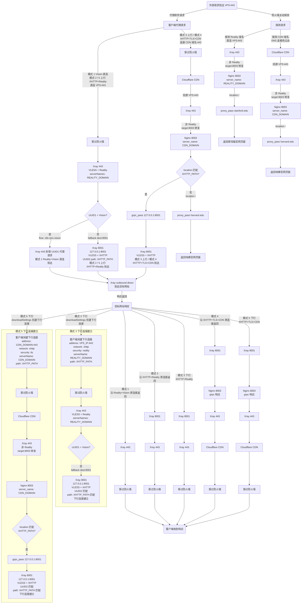
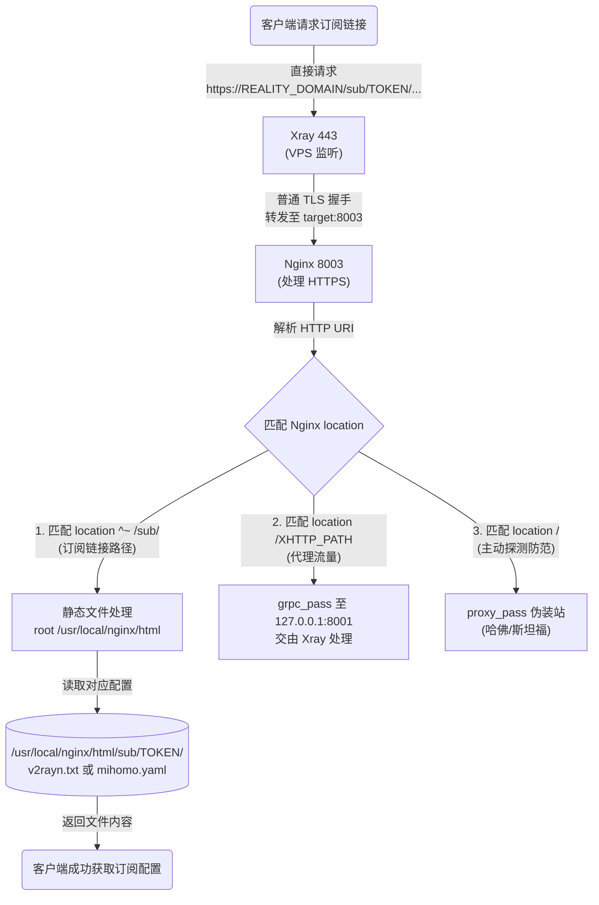

# XHTTP + CDN 上下行分离配置指南

这个仓库用于整理一套基于 Xray-core 的 XHTTP + CDN 搭建方案，覆盖环境准备、服务端配置和客户端模板三部分内容。
支持小火箭、Xray和Mihomo客户端，支持IPv4和IPv6。
> **提示**：推荐使用全新未搭建过类似服务的机器，这样可以避免很多隐形冲突。
> **注意**：教程使用 VLESS Encryption，客户端（V2rayN、Mihomo客户端）也需要更新到支持 vlessenc / xhttp 的新版本。
> **Mihomo 版本要求**：客户端Mihomo内核版本≥`1.19.24`。

## 模式

仓库文档用于搭建包含以下 5 种模式：

1. Reality Vision 直连
2. XHTTP + Reality 上下行不分离
3. 上行 XHTTP + TLS + CDN，下行 XHTTP + Reality
4. XHTTP + TLS 双向 CDN
5. 上行 XHTTP + Reality，下行 XHTTP + TLS + CDN

---

## 一键部署

> **前置条件**：运行脚本前需在 Cloudflare 完成以下设置：
> 1. Reality 域名 DNS → 仅 DNS（灰色云朵）
> 2. CDN 域名 DNS → 代理开启（橙色云朵）
> 3. SSL/TLS 加密 → 完全（严格）
> 4. 网络 → gRPC → 已开启
> 5. 缓存规则（建议） → 将 XHTTP 路径设为绕过缓存，具体步骤请参考Github仓库的 [环境配置.md](./1.环境配置.md)。
> 6. [install.sh](./install.sh)：一键部署脚本，自动完成全部安装配置并生成 V2rayN / Mihomo 客户端配置。

在 VPS (Debian/Ubuntu) 上执行：

```bash
bash <(curl -fsSL https://raw.githubusercontent.com/Yulinanami/my-xhttp-cdn-config/refs/heads/master/install.sh)
```

或者下载后运行：

```bash
wget -O install.sh https://raw.githubusercontent.com/Yulinanami/my-xhttp-cdn-config/refs/heads/master/install.sh && bash install.sh
```
> **提示**：脚本可以重新执行即可更新域名、回落网站等参数。

脚本会提示输入两个域名，其余参数（UUID、密钥、shortId、路径）全部自动生成。完成后会同时生成：

- `~/client-config.txt`：V2rayN / Shadowrocket 可用的 Xray URI 节点
- `~/client-config-mihomo.yaml`：Mihomo 可直接导入的 YAML 配置

同时会输出订阅地址，默认使用 `REALITY_DOMAIN`：

- `v2rayn.txt`：适用于 **V2RayN / Shadowrocket**
- `mihomo.yaml`：适用于 **Mihomo**
- `~/subscription-links.txt`：订阅链接汇总
- `~/subscription-v2rayn.png`：V2RayN / Shadowrocket 订阅二维码
- `~/subscription-mihomo.png`：Mihomo 订阅二维码

### 脚本主要流程

大致执行流程如下：

1. **读取输入参数**
   - Reality 域名
   - CDN 域名
   - IPv4 / IPv6
   - Reality 回落网站
   - CDN 回落网站

2. **提取回落网站URL**
   - 支持输入域名或完整 URL
   - 会自动忽略路径、查询参数、片段，只保留根站
   - 自动提取上游 `Host`
   - 后续写入 Nginx 时自动启用 `proxy_ssl_server_name on;` 与 `proxy_ssl_name`
   - 自动加入 `proxy_redirect`，避免浏览器跳到内部端口 `:8003`

3. **安装 / 检查基础依赖**
   - curl / sudo / socat / wget / tar / openssl
   - cron（用于证书自动续期）
   - qrencode（用于订阅二维码输出）

4. **安装或更新 Xray**
   - 调用官方安装脚本安装 / 更新 Xray
   - 自动准备 systemd 服务

5. **自动生成运行参数**
   - UUID1（Vision）
   - UUID2（XHTTP）
   - X25519 公私钥
   - shortId
   - XHTTP path
   - VLESS Encryption / Decryption 密钥
   - 自动获取当前 VPS 的 IPv4 或 IPv6 地址

6. **申请或复用双域名证书**
   - 使用 `acme.sh` 为 `REALITY_DOMAIN + CDN_DOMAIN` 申请双域名证书
   - 如果检测到当前这组域名已有可复用证书，则直接复用
   - 证书最终安装到固定路径：
     - `/etc/ssl/private/fullchain.cer`
     - `/etc/ssl/private/private.key`

7. **配置证书自动续期**
   - `acme.sh` 安装时会写入自动续期任务
   - 脚本使用 `acme.sh --install-cert ... --reloadcmd "systemctl restart nginx"` 安装证书

8. **重写 Nginx 配置**
   - 直接覆盖 `/etc/nginx/nginx.conf`
   - Reality 域名：
     - 负责直连订阅下载
     - 负责主动探测回落伪装
   - CDN 域名：
     - 负责 CDN 流量入口
     - 负责主动探测回落伪装

9. **重写 Xray 配置**
   - 直接覆盖 `/usr/local/etc/xray/config.json`
   - 写入 Vision、XHTTP、Reality、CDN 相关入站与出站配置

10. **配置测试并启动服务**
   - 执行 `nginx -t`
   - 执行 `xray -test -config /usr/local/etc/xray/config.json`
   - 测试通过后重启 `xray` 与 `nginx`

11. **生成客户端文件**
   - `~/client-config.txt`
   - `~/client-config-mihomo.yaml`

12. **生成订阅文件**
   - 订阅目录位于 `/usr/local/nginx/html/sub/TOKEN/`
   - 默认复用 `/etc/xhttp-cdn/sub_token` 中已有 token
   - 如果是首次部署，则自动生成 token

13. **生成订阅摘要与二维码**
   - `~/subscription-links.txt`
   - `~/subscription-v2rayn.png`
   - `~/subscription-mihomo.png`
   - 同时在终端打印二维码，方便手机扫描导入


## 手动部署

按下面的顺序阅读和执行：

1. [环境配置.md](./1.环境配置.md)，完成 Cloudflare 设置、Xray 安装、证书申请和 Nginx 安装。
2. [文件配置.md](./2.文件配置.md)，完成 Nginx 与 Xray 配置，并执行测试与重启命令。
3. [客户端模板.txt](./客户端模板.txt)，复制到 V2rayN，替换 `YOUR_*` 占位符后使用。
4. [客户端模板-mihomo.yaml](./客户端模板-mihomo.yaml)，Mihomo内核客户端的配置文件，替换 `YOUR_*` 占位符后导入。

## 安全

- **VLESS Encryption (vlessenc)**：脚本自动启用 VLESS Encryption，在 VLESS 协议层增加端到端加密（ML-KEM-768 + X25519 后量子安全算法 + PFS），防止 CDN 中间人解密流量内容
- 仅对 XHTTP 入站启用 vlessenc（因为只有它过 CDN），Vision 直连不需要
- 把来自防火墙的主动探测默认转发到斯坦福和哈佛的官网来进行伪装（建议根据自己VPS的所在地区来修改，改成你VPS所在地的大学官网伪装能力会更好）

---

## 流程图（去程 + 回程）



### 订阅链接获取流程

脚本会在 `/usr/local/nginx/html/sub/` 目录下生成随机 Token 文件夹，存放客户端配置文件。默认订阅地址为：

- `https://REALITY_DOMAIN/sub/TOKEN/v2rayn.txt`
- `https://REALITY_DOMAIN/sub/TOKEN/mihomo.yaml`



---

## 参考资料

- Xray小白搭建教程： https://xtls.github.io/document/level-0/ch06-certificates.html 和 https://xtls.github.io/document/level-0/ch07-xray-server.html
- Xray-core Xhttp-CDN 上下行分离讨论: https://github.com/XTLS/Xray-core/discussions/4118
- Xhttp-CDN 上下行分离手搓: https://jollyroger.top/sites/361.html
- Mihomo xhttp 讨论: https://github.com/MetaCubeX/mihomo/discussions/2669
- Mihomo 文档（VLESS / 传输层 / TLS）: https://wiki.metacubex.one/config/proxies/vless/ 、https://wiki.metacubex.one/config/proxies/transport/ 、https://wiki.metacubex.one/config/proxies/tls/
- Mihomo 分流规则配置: https://github.com/xiaolin-007/clash-verge-script
